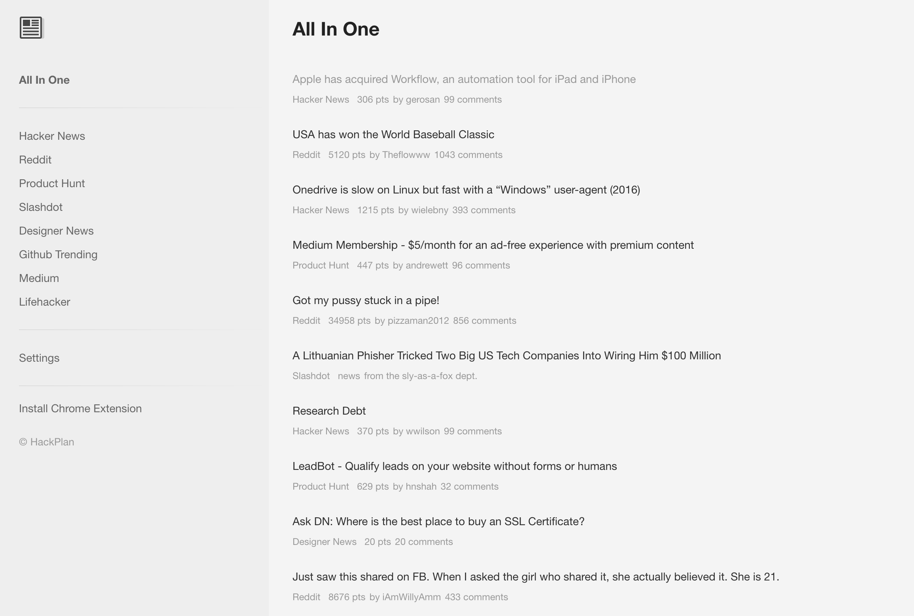
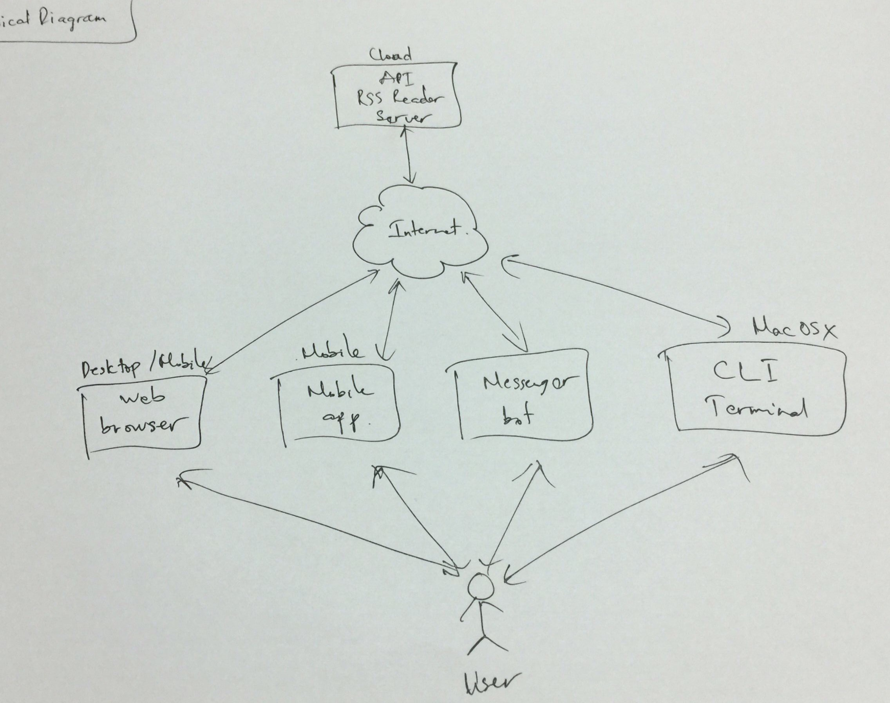
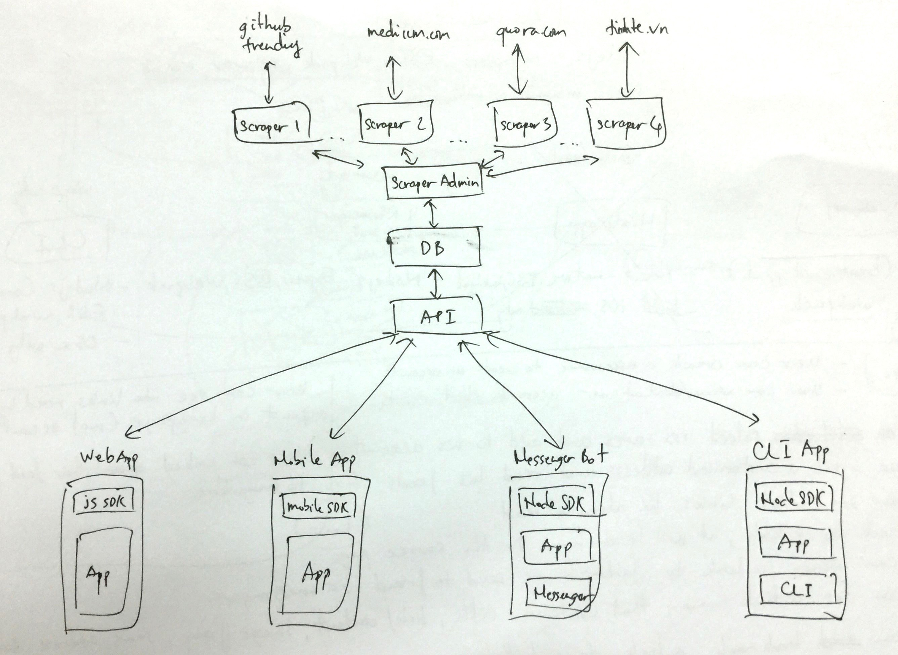

# [reader](https://reader.gorillab.co)

A customizable feeds reader on web, mobile, messenger bot and even terminal platforms.

## Inspiration

The idea is started from each [Gorillab](https://gorillab.co)'s members struggling to find a good, minimal & beautiful feeds reader. And to be inspired by a simple yet [reader.one](http://reader.one) app, we decide to create our own reader that not only meets our needs but also to develop new app development skills.

## Overview

User can read news on the web, mobile apps, messenger bot or even terminal.

## Architecture

### Apps

Reader will be developed in several platforms:
- Web app: react
- Mobile app (iOS): react-native
- Chat bot: messenger platform
- CLI app (Terminal on Mac OS X): commander

Repositories:
- [reader-web](https://github.com/gorillab/reader-web): web-based app
- [reader-theme](https://github.com/gorillab/reader-theme): customized bootstrap theme

### SDKs

SDKs that help Reader apps to work with the api to get/update data. Based on the platforms, we will develop:
- JS SDK: web & mobile apps
- Node SDK: messenger bot & CLI app

Repositories:
- [reader-js](https://github.com/gorillab/reader-js): js sdk

### API Service

Node/Express based API web service that serves feeds to user.

Repositories:
- [reader-api](https://github.com/gorillab/reader-api): api service

### Scraper Admin

The admin service that manages multiple scrapers. It will ask them periodically to scrap data from specified source and store responded data to the database.

Repositories:
- [reader-scraper-admin](https://github.com/gorillab/reader-scraper-admin): scrapers admin service

### Scraper

The service that scrap data from specified source whenever the admin requests.

Repositories:
- [reader-scraper](https://github.com/gorillab/reader-scraper): base scraper service
- [reader-github-trending](https://github.com/gorillab/reader-github-trending): github trending scraper based on reader-scraper

### Database

Feeds, user accounts and data storage.

## Technologies

- Front-end: React, React-Native, Messenger Platform, Commander, Bootstrap, Sass
- Back-end: Express, Passport, Mongoose
- DB: MongoDB
- Tools: swagger-node, feedparser, create-react-app, create-react-native-app

Repositories:
- [swagger-node](https://github.com/gorillab/swagger-node): for generating api, scrapers & scraper-admin services from openapi yaml file
