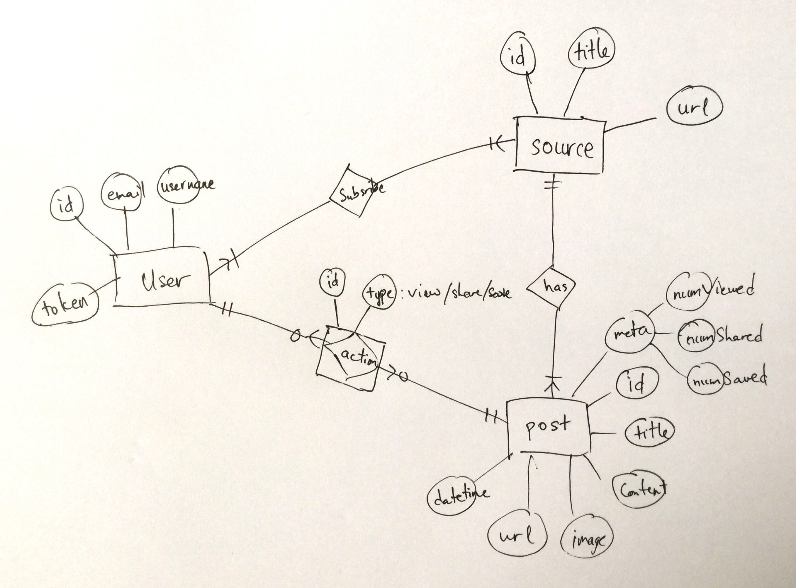

# [reader](https://reader.gorillab.co)

A customizable feeds reader on web, mobile, messenger bot and even terminal platforms.

## Inspiration

The idea is started from each [Gorillab](https://gorillab.co)'s members struggling to find a good, minimal & beautiful feeds reader. And to be inspired by a simple yet [reader.one](http://reader.one) app, we decide to create our own reader that not only meets our needs but also to develop new app development skills.

## Overview

User can read news on the web, mobile apps, messenger bot or even terminal.

The interesting parts are everyone can see each other's feeds & activities on there own wall (like facebook timeline). And that means there will be a place you can explore the world's activities, that is the homepage.

Interesting right! Keep moving to the Architecture of reader.

## Architecture

The following topics describe each part of the software architecture.

### Apps

Reader will be developed in several platforms:
- Web app: react
- Mobile app (iOS): react-native
- Chat bot: messenger platform
- CLI app (Terminal on Mac OS X): commander

### SDKs

SDKs that help Reader apps to work with the api to get/update data. Based on the platforms, we will develop:
- JS SDK: web & mobile apps
- Node SDK: messenger bot & CLI app

### API Service

Node/Express based API web service that serves feeds to user.

### Scraper Admin

The admin service that manages multiple scrapers. It will ask them periodically to scrap data from specified source and store responded data to the database.

### Scraper

The service that scrap data from specified source whenever the admin requests.

### Database

Feeds, user accounts and data storage.

## Database Design

### User

The user account with basic information.

### Source

The source entity is our news source such as Hacker News, GitHub Trending, Medium, Quora, etc. The user will subscribe source(s) to read news.

### Post

This is the news post from source that user subscribed. The user is not only able to read but also to share and save (bookmark) for later reading.

## Technologies

- Front-end: React, React-Native, Messenger Platform, Commander, Bootstrap, Sass
- Back-end: Express, Passport, Mongoose
- DB: MongoDB
- Tools: swagger-node, feedparser, create-react-app, create-react-native-app

## Development Stages

### Development

Reader will be run in local at [https://reader.dev](https://reader.dev). Checkout the following repositories for development:

**Web**
- [reader-web](https://github.com/gorillab/reader-web): web-based app
- [reader-theme](https://github.com/gorillab/reader-theme): customized bootstrap theme
- [reader-js](https://github.com/gorillab/reader-js): js sdk

**Services**
- [reader-api](https://github.com/gorillab/reader-api): api service
- [reader-scraper-admin](https://github.com/gorillab/reader-scraper-admin): scrapers admin service
- [reader-scraper](https://github.com/gorillab/reader-scraper): base scraper service
- [reader-github-trending](https://github.com/gorillab/reader-github-trending): github trending scraper based on reader-scraper

**Tools**
- [swagger-node](https://github.com/gorillab/swagger-node): for generating api, scrapers & scraper-admin services from openapi yaml file

### Staging

We use Heroku to run many instances of reader services:
- Web: [https://glab-reader-web.herokuapp.com](https://glab-reader-web.herokuapp.com)
- API: [https://glab-reader-api.herokuapp.com](https://glab-reader-api.herokuapp.com)
- Scraper Admin: [https://glab-reader-scraper-admin.herokuapp.com](https://glab-reader-scraper-admin.herokuapp.com)
- Github Trending Scraper: [https://glab-reader-github-trending.herokuapp.com](https://glab-reader-github-trending.herokuapp.com)

### Production

Reader web app will be lived at [https://reader.gorillab.co](https://reader.gorillab.co)

## Product Roadmap

Check this [GitHub Board](https://github.com/gorillab/reader/projects/1) for Reader's roadmap.

## Gorillab Team

Our members are on GitHub:

- [Chau Duong](https://github.com/orgs/gorillab/people/chauduong1192)
- [Khang Huynh](https://github.com/orgs/gorillab/people/khanghuynh92)
- [Phat Pham](https://github.com/orgs/gorillab/people/phatpham9)
- [Phu Tang](https://github.com/orgs/gorillab/people/tangkhanhphu)

Gorillab | [Website](https://gorillab.co) | [GitHub](https://github.com/gorillab) | [Say Hello!](hello@gorillab.co)